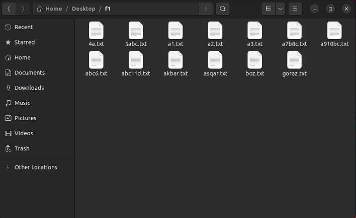
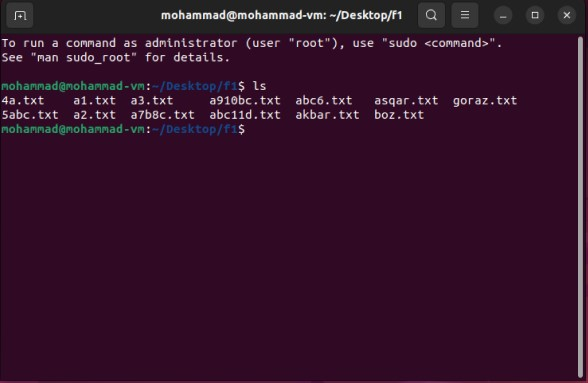
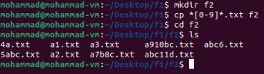
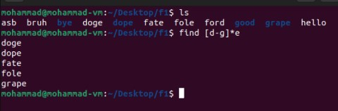

# تمرین 2 آز سیستم عامل

### تمرین 1
برای شروع ابتدا تعدادی فایل txt با نام های مختلف ایجاد میکنیم.

محتویات پوشه را در ترمینال با دستور `ls` مشاهده میکنیم:

با دستور `mkdir f2` یک پوشه با نام f2 ایجاد میکنیم تا فایل هایی که میخواهیم کپی کنیم را درون آن بریزیم.
درادامه با دستور `cp *[0-9]*.txt f2` تمام فایل های `txt` که در نام آنها حداقل یک عدد وجود دارد را در دایرکتوری f2 کپی میکنیم.

مشاهده میکنیم که فقط فایل هایی که در اسمشان عدد وجود دارد کپی شده اند.

### تمرین 2
ابتدا تعدادی فایل و فولدر ایجاد میکنیم تا فایل هایی برای پیدا شدن با شرایط ما وجود داشته باشد.
سپس با دستور `find [d-g]*e` تمام فایل ها و دایرکتوری هایی که با حروف d تا g شروع و به حرف e ختم میشوند را نمایش میدهیم.

این روش راحت ترین راه برای انجام اینکار است. راه های دیگری مانند استفاده از دستورات `ls` یا `find` و در ادامه فیلتر کردن خروجی آنها توسط دستور `grep` نیز وجود دارد.
